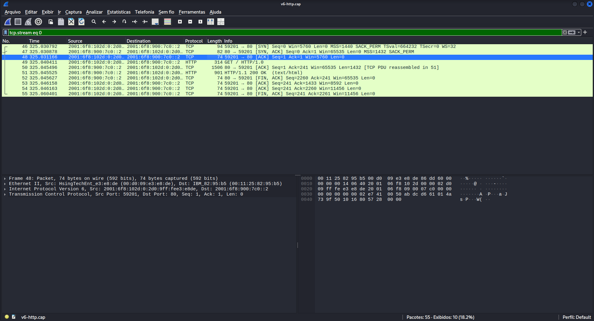
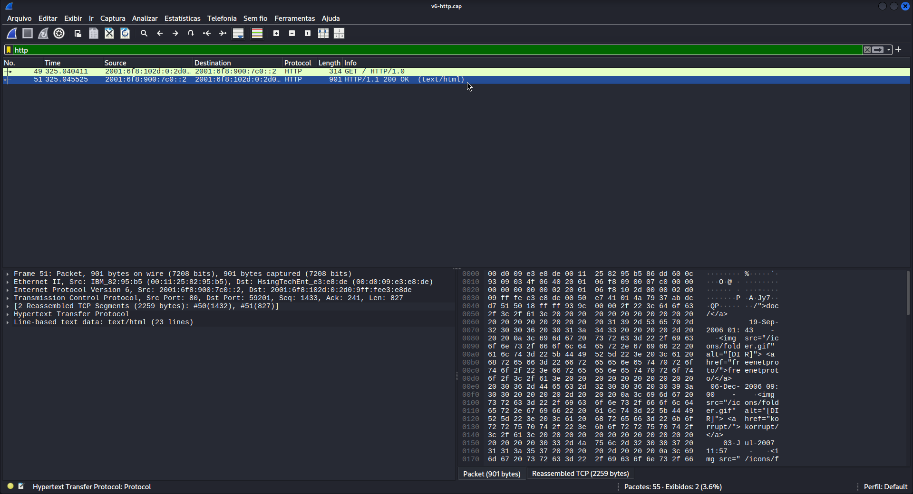
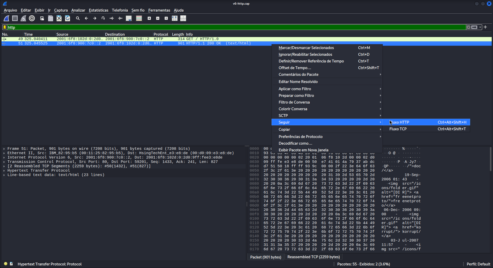
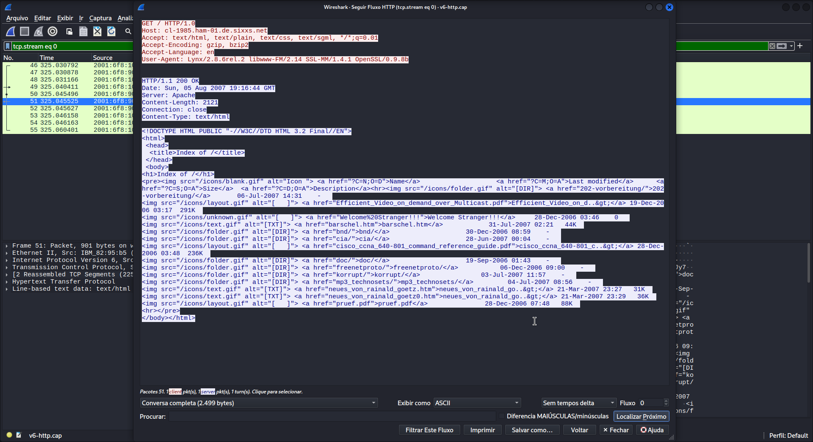

# wireshark-packet-analys
This repository contains an analysis of a network traffic capture (a `.cap` file) focused on the HTTP/1.1 protocol, demonstrating how text-based communication works between a client and a web server.

## 🛠️ Tools Used
* Wireshark

## 🔍 Analysis Flow

### 1. TCP Connection (Three-Way Handshake)
Before HTTP sends any data, TCP establishes a reliable connection. In the file, we can observe the first three packets performing this process:
* **Packet 1:** Client sends `[SYN]`
* **Packet 2:** Server responds with `[SYN, ACK]`
* **Packet 3:** Client confirms with `[ACK]`
* * **Filter used:** `tcp.stream eq 0"`

### 2. The HTTP GET Request
The client requests the main file from the server using the `GET` method.

* **Filter used:** `http`

### 3. Server Response and Content
By inspecting the response packet (`HTTP/1.1 200 OK`) and following the TCP stream (*Follow TCP Stream*)

it is possible to see the raw HTML code that was delivered to the user:

## 📘 Wireshark Guide
To help others use the tool, I am making the Wireshark user guide available here.

